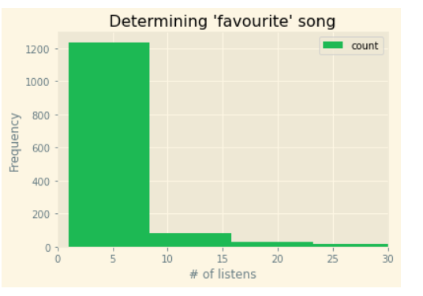

# Spotify Song Recommender
Building a song recommender based off the spotify song features of my listening history.

According to Spotify's Wrapped for 2020, I was in the **top 0.5 %** of J. Cole's listeners. #realcoleworld. However, spotify has a plethora of songs by millions of artists available and I feel like I am missing out and should explore new songs. I created a classifier to predict if I would like a song or not.

## Data
- StreamingHistory.json - personal listening history provided by spotify 
- [tracks.csv](https://www.kaggle.com/yamaerenay/spotify-dataset-19212020-160k-tracks?select=tracks.csv) - dataset containing audio features of around 600k songs from kaggle

### spotipy
[Spotipy](https://spotipy.readthedocs.io) - a lightweight python library for the Spotify Web API - was used to obtain audio features of missing songs.  

## Spotify Song Features
Spotify gives all songs several audio features such as: *danceability, energy, loudness, speechiness, acousticness, instrumentalness, liveness, valence and tempo.*

- A great article describing spotify audio features [here](https://medium.com/@boplantinga/what-do-spotifys-audio-features-tell-us-about-this-year-s-eurovision-song-contest-66ad188e112a#379f) 
- Spotify API reference [here](https://developer.spotify.com/documentation/web-api/reference/#endpoint-get-audio-features)

I'll be using these audio features to find the highest correlation with my **favourite** songs.  

### Dependent variable
The variable 'favourite' will be the prediction variable. I will assign the songs that have more than or equal to 9 listens with 1 (favourite) and less than 9 listens as 0 (not favourite). 
A sharp drop off at 9 listens of a song on the histogram clearly divides the songs that I deliberately listen to and the ones that I clicked on by accident or when I was trying to find new music.

## Goals

## Conclusion

## Credits
[isacmlee's song recommender](https://github.com/isacmlee/song-recommender.git)
